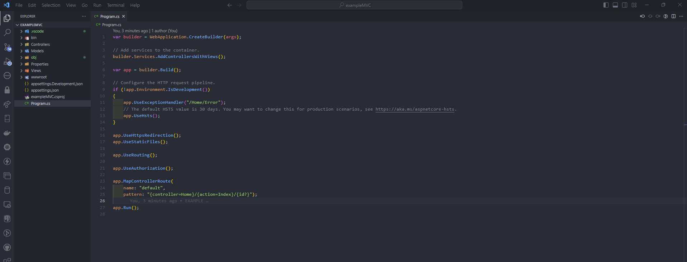

<h2 align="center"> FullStack .Net and Angular </h2>

<p align="center">
  
   </a>
    
  </a>
  <a href="https://github.com/BrianMarquez3/FullStack/stargazers">
    
  </a>
  <a href="https://github.com/BrianMarquez3/FullStack/network">
    
  </a>
    
  </a>
  
  </a>
    
  </a>
  
  </a>
    
  </a>
  
   </a>
   <a href="https://github.com/BrianMarquez3/FullStack/network">
  </a><br>
 
  
  
  
</p>
  
<table align="center">
  <tr>
    <td align="center" style="padding=0;width=50%;">
      
      <h4 align="center"> Angular - .NET </h4>
    </td>
  </tr>
</table>

## dotnet new TEMPLATE (Visual Studio Code)

_Comandos_

[Dotnet](https://learn.microsoft.com/en-us/dotnet/core/tools/dotnet-new)

[https://github.com/BrianMarquez3/FullStack/tree/main/Tools]


## Compila Visual Studio Code


_Console_

```bash
dotnet console
```


<table align="center">
  <tr>
    <td align="center" style="padding=0;width=50%;">
      
      <h4 align="center"> Angular - .NET </h4>
    </td>
  </tr>
</table>

Debug or F5


<table align="center">
  <tr>
    <td align="center" style="padding=0;width=50%;">
      
      <h4 align="center"> Angular - .NET </h4>
    </td>
  </tr>
</table>


_ASP_

Using MVC

<table align="center">
  <tr>
    <td align="center" style="padding=0;width=50%;">
      
      <h4 align="center"> Angular - .NET </h4>
    </td>
  </tr>
</table>

F5

<table align="center">
  <tr>
    <td align="center" style="padding=0;width=50%;">
      
      <h4 align="center"> Angular - .NET </h4>
    </td>
  </tr>
</table>


## Vscode Online

[Visual Estudio Code online](https://vscode.dev/)